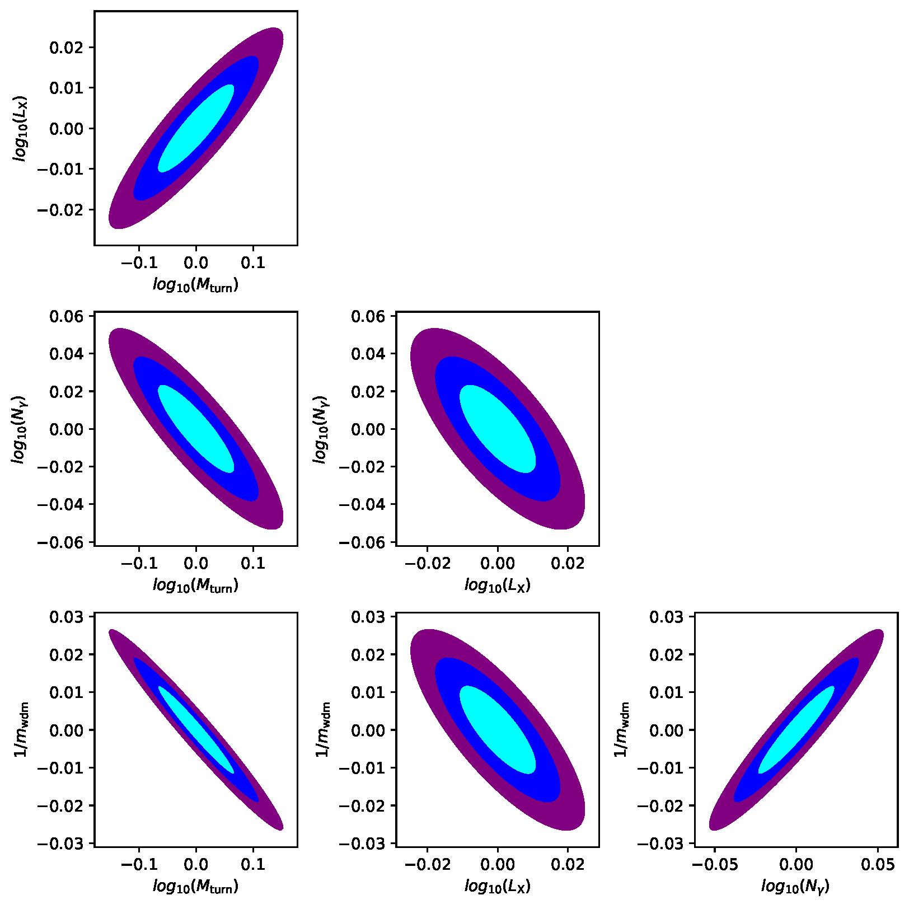

# Fisher21WDM

Scripts to compute the covariance matrix and the Fisher matrix from 21 cm power spectra in cosmologies with warm dark matter. The 21 cm power spectra are computed from simulations performed with the code [21cmFAST](https://github.com/andreimesinger/21cmFAST/commits/master).

The parameters considered in the simulations are: the warm dark matter mass, the X-ray luminosity (quantifying the heating in the intergalactic medium), the turnover mass (minimum halo mass to host star formation) and number of ionizing photons per baryon (setting the efficiency of ionizing sources).

## Codes

Here is a brief description of the scripts:

- `CreateFisherSimulations.py`: creates copies of the 21cmFAST code with the relevant values of the parameters to compute the derivatives.

- `BatchDriverFisher.py`: writes and runs a sbatch script to perform the simulations in the folders previously created by `CreateFisherSimulations.py`.

- `FisherPowerSpecWDM.py`: loads the 21 cm power spectra from the simulations to compute the derivatives, the covariance matrix and the Fisher matrix.
